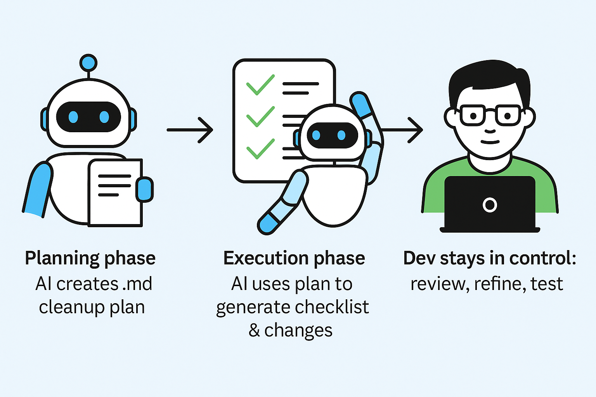

# Lesson 21: Personal Workflows

<div align="center">
  
</div>

## Objectives
- Master personal workflow patterns for AI collaboration
- Learn documentation strategies for complex tasks
- Build your own best practices library
- Integrate AI into your professional development workflow

These are workflow patterns discovered through experience—your personal "playbook" for effective AI collaboration.

**Why Personal Workflows Matter:**

✅ **Benefits:**
- **Clear Thinking**: Planning and organization forces clarity
- **Reusability**: Patterns that work become habits
- **Team Sharing**: Your workflows can help others

## AILog.md for Large Tasks

One technique I use to improve continuity in my AI-assisted workflows is maintaining an "AI log" file. The purpose of this log is to capture the agent’s progress, decisions, and outputs in a structured way, so I can easily switch between sessions or contexts without losing valuable information.

While some AI-integrated IDEs (like Cursor) provide access to past conversations, they often present condensed or summarized versions of those chats. This can be convenient, but it introduces a risk: key details may be omitted or lost in the summarization process, and you don’t have full control over what gets preserved.

By keeping my own log, I ensure that critical insights, assumptions, prompts, and intermediate results are recorded accurately and completely. It’s a simple habit that helps maintain continuity, improve reproducibility, and reduce cognitive load—especially during complex or multi-step tasks.

**When to Use:**
- Multi-day features
- Complex refactorings
- Research projects
- Architecture decisions

**Example:**
```markdown
Document your implementation process in `myFeature-AILog.md`. Ensure the log is sufficiently detailed and actionable for handover to another AI agent.

AI Log Requirements:
- Each log entry must include:
- Date and time
- Phase name or checklist item
- Implementation details and rationale
- Listed questions/uncertainties (with answers provided, if available)

Output Structure:
## [Date and Time] - [Phase Name or Checklist Item]
**Implementation Details:**
- Describe process, decisions, and rationale.
**Questions/Uncertainties:**
- List current questions/uncertainties. If you requested and received clarification, provide both question and answer.
**Next Steps:**
- State planned steps after this phase.

If any questions or ambiguities remain after a phase, prominently highlight them in the 'Questions/Uncertainties' section.
```

**Benefits:**
- ✅ Easy to resume after breaks
- ✅ Clear progress tracking
- ✅ Decisions documented with rationale
- ✅ Can share with team for context
- ✅ Switch between chats without losing context

## Planning Files for Complex Features

<div align="center">
   Exection workflow" width="60%">
</div>

The Model doesn’t know codebase as well as you → this is where it struggles

**Steps to improve output**
- Clearly outline goals
- Brain dump: files, tests, gating, dependencies, exclusions
- Specify if constraints, changes you want to handle manually
- Imagine doing the cleanup manually, without AI. How would you approach it?
- Write reasoning steps (as if doing manually)
- Structure prompt for clarity

**Why Planning First?**
- By creating a clear and concise planning document for the next phase, you can better manage the model’s context window and reduce the likelihood of hallucinations
- A planning document is easier to parse than code diffs
- Faster to spot mistakes/missing items
- Improves execution accuracy
- Iterating on planning prompt = better coverage, fewer misses

**Execution Phase**
- Based on the planning document which provides a better end result for the cleanup task
- AI handles grunt work, dev reviews and refines
- Create and update a detailed checklist as it progresses

**When to Use:**
- New features with multiple components
- Architecture changes
- System refactoring
- You need to provide very clear implementation steps
- You need to manage large context

**Step 1: Create the planning file**

```markdown
# Objective
- Support the development of <feature_X> by reviewing, planning, and summarizing all required changes for the upcoming development phase before any coding begins.

# Checklist
- Begin with a concise checklist outlining the key review and planning sub-tasks.

# Instructions
- Carefully read the <Product_documentation> and <Technical_documentation> for a complete understanding of the project context.
- Review the <Code_standards_file> to ensure alignment with our coding standards.
- Break down each problem or requirement into discrete tasks.
- Use <Technical_documentation> as reference for implementation details.
- Identify and record any unknowns or ambiguities in the documentation.
- After finalizing the implementation plan, validate that every task and required change is clearly referenced with its documentation source, and confirm the Unknowns and Next Steps section includes all open questions before submission.

# Output Format
You are to create a Markdown file named `feature_X-implementation-plan.md` with the following structure:
\`\`\`
# Feature X Implementation Plan
## Checklist
- [ ] List each key review or planning sub-task here
## Summary of Required Changes
Organize the necessary changes by the following sections. For each, include:
- A brief, actionable description of the required change
- A reference to the pertinent section(s) or requirement(s) from source documentation or code standards (as applicable)
### Code Implementation
### Unit Tests
### Integration Tests
### UI Tests
### Documentation Changes
#### New
#### Updates
## Unknowns and Next Steps
Bullet-point any uncertainties, missing context, or ambiguities. Include recommended actions for clarification.
\`\`\`

## Error Handling
If any referenced files (such as <Product_documentation>, <Technical_documentation>, or <Code_standards_file>) are unavailable, incomplete, or unclear, explicitly document these under Unknowns and Next Steps.

# Validation
- After producing the plan, provide a brief validation stating that all relevant changes are accounted for, source documents referenced, and any outstanding questions are articulated under next steps. If any required input is unavailable, state this explicitly in Unknowns and Next Steps.

# Stop Conditions
- Do not begin coding work until the planning phase is complete and has received explicit approval.
```

**Step 2: Sequential Implementation**

Use the plan file as reference. In each session:
```markdown
# Role and Objective
You are a senior frontend developer. Implement the next development of <feature_X> for the project, guided by provided documentation. Maintain thorough logs for seamless handover.

# Instructions
Begin with a concise checklist outlining your planned sequence before starting work on each phase.

- Review the plan file `feature_X-implementation-plan.md` to understand the code changes to be implemented.
- Complete 1 step at a time
- Upon completion of each checklist item , mark it as completed using Markdown checklist syntax (e.g., `- [x] Item Name`). Always include the updated checklist in your output.
- Document your implementation process in the `feature_X-AILog.md` file.
- After each checklist item completion or edit, validate the result in 1–2 sentences to ensure objectives are met. If the validation fails, self-correct or note action taken.

# Verification
- Ensure all checklist items are completed and the code changes are implemented

# Stop Conditions
- If you encounter uncertainty or missing information, pause and request clarification before proceeding. Clearly log uncertainties or questions as they arise.
```

**Benefits:**
- ✅ Clear roadmap
- ✅ All requirements captured
- ✅ Decisions documented
- ✅ Can work incrementally
- ✅ Easy to resume

## Code Comment Stubbing for Tests

**When to Use:**
- Writing unit tests
- Complex test scenarios
- Want AI to follow specific structure

**Process:**

```typescript
// Write tests as comments first, then have AI implement

describe('NotificationStore', () => {
  // Test: should initialize with empty notifications array
  
  // Test: should add notification to state
  
  // Test: should mark notification as read
  
  // Test: should remove notification
  
  // Test: should handle WebSocket message and add notification
  
  // Test: should not add duplicate notifications (same ID)
  
  // Test: should limit to 100 notifications (remove oldest)
  
  // Test: should persist to localStorage on changes
  
  // Test: should load from localStorage on init
});
```

**Then prompt:**
```markdown
Implement these tests following the comment structure.
Use Jest and React Testing Library.
Mock WebSocket and localStorage.
```

**Result:**
```typescript
describe('NotificationStore', () => {
  beforeEach(() => {
    localStorage.clear();
  });
  
  it('should initialize with empty notifications array', () => {
    const { result } = renderHook(() => useNotificationStore());
    expect(result.current.notifications).toEqual([]);
  });
  
  it('should add notification to state', () => {
    const { result } = renderHook(() => useNotificationStore());
    const notification = createMockNotification();
    
    act(() => {
      result.current.addNotification(notification);
    });
    
    expect(result.current.notifications).toHaveLength(1);
    expect(result.current.notifications[0]).toEqual(notification);
  });
  
  // ... rest of tests following comment structure
});
```

**Benefits:**
- ✅ AI follows your test structure
- ✅ Ensures all scenarios covered
- ✅ Clear test organization
- ✅ Easy to review coverage

## Debugging with AI

**When to Use:**
- Bug fixing and troubleshooting
- Performance issues
- Understanding error messages

**Why AI is Effective for Debugging:**

**Strengths:**
- Pattern recognition across vast codebases
- Quick identification of common error patterns
- Explaining complex error messages
- Suggesting multiple potential solutions
- Walking through debugging steps

**Limitations:**
- Can't run your code or see runtime state
- Might suggest fixes for symptoms, not root causes
- May hallucinate about your codebase
- Needs appropriate context to be effective

**The Debugging Process with AI:**

**1. Context Gathering**
- What is the expected behavior?
- What is the actual behavior?
- Error messages and stack traces
- Relevant code
- Environment details

**2. Hypothesis Generation**
- AI suggests potential causes
- Multiple possibilities explored

**3. Validation**
- Test suggested fixes
- Verify understanding of root cause

**4. Implementation**
- Apply fix with confidence
- Add safeguards against recurrence

**Effective AI-Assisted Debugging Steps:**

**Step 1: Describe the Bug Clearly**

```markdown
❌ Vague: "My component is broken"
✅ Clear: "My UserProfile component renders correctly on initial load but shows 
stale data when the userId prop changes from user A to user B"
```

**Step 2: Provide Error Information**

Include:
- Exact error messages
- Stack traces
- Console warnings
- Network errors (if applicable)

```markdown
Error: Cannot read property 'name' of undefined
Location: UserProfile.tsx:45

Stack trace:
  at UserProfile (UserProfile.tsx:45)
  at Dashboard (Dashboard.tsx:120)
```

**Step 3: Show Relevant Code**

Not all code—just the relevant parts:

```markdown
Relevant component code:
[UserProfile component...]

Related data fetching:
[API hook code...]

Don't include:
- Styling code (unless styling-related bug)
- Unrelated components
- Entire file if only one function has the issue
```

**Step 4: Describe Expected vs Actual**

```markdown
Expected behavior:
- When userId prop changes, component should fetch new user data
- Display loading state during fetch
- Show new user's profile when loaded

Actual behavior:
- Component doesn't refetch when userId changes
- Shows previous user's data
- No loading state appears
```

**Step 5: Apply Chain of Thought**

```markdown
Debug this issue step-by-step:
1. Analyze the component lifecycle and prop changes
2. Identify why the useEffect isn't retriggering
3. Explain the root cause
4. Suggest the fix with explanation
```

**Step 6: Request Multiple Solutions**

```markdown
Provide:
1. The immediate fix
2. A more robust solution
3. How to prevent this issue in the future
```

**Debugging Examples:**

**Example 1: Component Not Updating Bug**

```markdown
# Bug Report

**Issue**: UserProfile component doesn't update when userId prop changes

**Expected**: Component should refetch and display new user data

**Actual**: Shows original user's data even when userId prop changes

**Code**:
\`\`\`tsx
const UserProfile: React.FC<{ userId: string }> = ({ userId }) => {
  const [user, setUser] = useState(null);
  const [loading, setLoading] = useState(true);

  useEffect(() => {
    const fetchUser = async () => {
      setLoading(true);
      const response = await fetch(`/api/users/${userId}`);
      const data = await response.json();
      setUser(data);
      setLoading(false);
    };

    fetchUser();
  }, []); // ⚠️ Empty dependency array

  if (loading) return <div>Loading...</div>;
  if (!user) return <div>No user found</div>;

  return (
    <div>
      <h2>{user.name}</h2>
      <p>{user.email}</p>
    </div>
  );
};
\`\`\`

**Debugging Steps**:
1. Analyze why the component doesn't update
2. Identify the root cause
3. Explain what the empty dependency array means
4. Provide the fix
5. Suggest best practices to avoid this
```

**Expected AI Response:**
```
Step 1: Analysis
The useEffect runs only once on mount because of the empty dependency array [].
When userId prop changes, useEffect doesn't rerun, so no new fetch occurs.

Step 2: Root Cause
The empty dependency array tells React "only run this effect once."
React doesn't know to refetch when userId changes.

Step 3: Dependency Array Explanation
- [] = run once on mount
- [userId] = run when userId changes
- no array = run on every render (usually not wanted)

Step 4: Fix
\`\`\`tsx
useEffect(() => {
  const fetchUser = async () => {
    setLoading(true);
    const response = await fetch(`/api/users/${userId}`);
    const data = await response.json();
    setUser(data);
    setLoading(false);
  };

  fetchUser();
}, [userId]); // ✅ Add userId to dependencies
\`\`\`

Step 5: Best Practices
- Always include used props/state in useEffect dependencies
- Use ESLint plugin: eslint-plugin-react-hooks to catch these
- Consider extracting to custom hook for reusability
```

**Example 2: Memory Leak Bug**

```markdown
# Bug Report

**Issue**: Console warning "Can't perform a React state update on an unmounted component"

**Context**: Happens when navigating away from UserProfile while data is still loading

**Error**:
\`\`\`
Warning: Can't perform a React state update on an unmounted component. 
This is a no-op, but it indicates a memory leak in your application.
\`\`\`

**Code**:
\`\`\`tsx
const UserProfile: React.FC<{ userId: string }> = ({ userId }) => {
  const [user, setUser] = useState(null);
  const [loading, setLoading] = useState(true);

  useEffect(() => {
    const fetchUser = async () => {
      setLoading(true);
      const response = await fetch(`/api/users/${userId}`);
      const data = await response.json();
      setUser(data);
      setLoading(false);
    };

    fetchUser();
  }, [userId]);

  if (loading) return <div>Loading...</div>;
  return <div>{user?.name}</div>;
};
\`\`\`

**Debug this**:
1. Explain why the warning appears
2. Identify what happens when component unmounts during fetch
3. Provide a fix with cleanup
4. Explain how the fix works
```

**Expected AI Response:**
```
Step 1: Why the warning appears
When the user navigates away:
1. Component unmounts
2. Fetch is still in progress
3. Fetch completes and calls setUser/setLoading
4. React detects state update on unmounted component

Step 2: What happens on unmount
- useEffect keeps running
- async function completes
- setState calls occur on unmounted component
- Memory leak: closure holds reference to unmounted component

Step 3: Fix with cleanup
\`\`\`tsx
useEffect(() => {
  let cancelled = false; // Cleanup flag

  const fetchUser = async () => {
    setLoading(true);
    const response = await fetch(`/api/users/${userId}`);
    const data = await response.json();
    
    // Only update state if not cancelled
    if (!cancelled) {
      setUser(data);
      setLoading(false);
    }
  };

  fetchUser();

  // Cleanup function
  return () => {
    cancelled = true;
  };
}, [userId]);
\`\`\`

Alternative with AbortController:
\`\`\`tsx
useEffect(() => {
  const controller = new AbortController();

  const fetchUser = async () => {
    try {
      setLoading(true);
      const response = await fetch(`/api/users/${userId}`, {
        signal: controller.signal
      });
      const data = await response.json();
      setUser(data);
      setLoading(false);
    } catch (error) {
      if (error.name !== 'AbortError') {
        // Handle other errors
        console.error(error);
      }
    }
  };

  fetchUser();

  return () => {
    controller.abort(); // Cancel fetch on unmount
  };
}, [userId]);
\`\`\`

Step 4: How it works
- Cleanup function runs when component unmounts or before re-running effect
- cancelled flag or AbortController prevents state updates after unmount
- Avoids memory leak and warning
```

**Example 3: Progressive Debugging Approach**

```markdown
# Bug Report

**Issue**: Form submission fails silently after client-side validation passes

**Context**:
- React Hook Form for form management
- Yup for validation
- Submission should POST to /api/contact

**Behavior**:
1. User fills form
2. Validation passes (no errors shown)
3. User clicks submit
4. Nothing happens (no error, no success, no network request)

**Initial Request**:
Start debugging by analyzing the form submission flow. What should we check first?

[After AI suggests checking onSubmit handler...]

**Follow-up 1**:
Here's the onSubmit handler:
[Code...]
What's next?

[After AI suggests checking network tab...]

**Follow-up 2**:
Network tab shows no request is made. Here's the button code:
[Button code...]
What's the issue?
```

This demonstrates **progressive debugging** where you provide context incrementally as you gather information.

**Debugging Exercise:**

Create a comprehensive debugging prompt for this scenario:

**Scenario**: Clicking a button causes the entire page to re-render, making the app slow.

**Your prompt should include**:
- Clear description of the issue
- Expected vs actual behavior
- Relevant code
- Debugging approach

**Solution**:
```markdown
# Performance Bug: Entire Page Re-renders on Button Click

## Issue
Clicking the "Update Theme" button causes the entire application to re-render, 
creating visible lag (2-3 second freeze).

## Expected Behavior
Only theme-related components should re-render when theme changes.

## Actual Behavior
All components re-render, including unrelated sections like the sidebar, 
footer, and data tables.

## Context
- Using React Context for theme management
- Context wraps the entire app
- ~50 components in the app
- Button is in the header component

## Relevant Code

Theme Context:
\`\`\`tsx
[ThemeContext code...]
\`\`\`

Header with Button:
\`\`\`tsx
[Header code...]
\`\`\`

Example Consumer (should not re-render):
\`\`\`tsx
[DataTable code...]
\`\`\`

## Debugging Request
Analyze this step-by-step:
1. Identify why all components re-render
2. Explain the relationship between Context changes and re-renders
3. Suggest optimization strategies
4. Provide implementation of the most effective solution

Focus on React rendering behavior and Context optimization patterns.
```

**Validation**:
- **Self-Check**: Does the prompt provide enough context?
- **Self-Check**: Is the debugging approach clear?
- **Self-Check**: Can the issue be diagnosed from the provided information?

**Real-World Debugging Scenarios:**

**Scenario 1: Race Condition Bug**

```markdown
# Bug: Stale Data Displayed on Rapid Navigation

## Issue
When clicking through user profiles quickly, sometimes the wrong user's 
data is displayed.

## Steps to Reproduce
1. Click on User A profile
2. Immediately click on User B profile (before A loads)
3. User B's header shows but User A's data displays in the body

## Analysis Needed
This appears to be a race condition. Debug by:
1. Analyzing the async data fetching flow
2. Identifying how race conditions can occur
3. Explaining why the last request doesn't always "win"
4. Providing a solution that handles request ordering

## Code
[UserProfile component with data fetching...]

## Expected Solution
Implementation that either:
- Cancels previous requests, or
- Ignores responses from outdated requests
```

**Scenario 2: Subtle State Bug**

```markdown
# Bug: Checkbox Becomes Uncontrollable

## Issue
After clicking a checkbox multiple times quickly, it stops responding to clicks.

## Behavior
- First few clicks work fine
- After rapid clicking, checkbox stops updating
- Console shows: "A component is changing a controlled input to be uncontrolled"

## Code
\`\`\`tsx
const [isChecked, setIsChecked] = useState(false);

const handleChange = (e) => {
  setIsChecked(e.target.checked);
  // Make API call to save preference
  savePreference(e.target.checked);
};

return (
  <input
    type="checkbox"
    checked={isChecked}
    onChange={handleChange}
  />
);
\`\`\`

## Debug Request
1. Explain the "controlled to uncontrolled" warning
2. Identify why rapid clicks cause this
3. Analyze the relationship between state updates and async operations
4. Provide a robust solution
```

**Scenario 3: Mysterious Re-render Loop**

```markdown
# Bug: Infinite Re-render Loop

## Issue
Component enters infinite re-render loop, browser tab becomes unresponsive.

## Error
\`\`\`
Error: Too many re-renders. React limits the number of renders to prevent an infinite loop.
\`\`\`

## Code
\`\`\`tsx
const UserList = () => {
  const [users, setUsers] = useState([]);
  const [filteredUsers, setFilteredUsers] = useState([]);
  const [searchTerm, setSearchTerm] = useState('');

  // Filter users when search term changes
  setFilteredUsers(
    users.filter(user => 
      user.name.toLowerCase().includes(searchTerm.toLowerCase())
    )
  );

  return (
    <div>
      <input 
        value={searchTerm}
        onChange={e => setSearchTerm(e.target.value)}
      />
      {filteredUsers.map(user => <UserCard key={user.id} user={user} />)}
    </div>
  );
};
\`\`\`

## Debug Request
1. Identify what's causing the infinite loop
2. Explain why this pattern creates the problem
3. Provide the correct pattern for derived state
4. Suggest alternative approaches (useMemo, useEffect)
```

**Debugging Practical Takeaway**: Debugging with AI is a conversation. Start with a clear description of the problem, provide relevant context, and use the debugging techniques you've learned (CoT, verification, progressive disclosure). The better you describe the bug, the more accurate the diagnosis. Always understand the suggested fix—don't just copy-paste. Ask follow-up questions if the reasoning isn't clear. And remember: AI can suggest solutions, but you validate them. Test, verify, and understand before implementing.

## Using AI for Legacy Code Cleanup

Cleanup tasks often sit in the backlog because they’re tedious and time-consuming.

This guide explains how to effectively use AI to support legacy code cleanup tasks. Following this process can save time, reduce repetitive manual effort, and ensure nothing is missed.

### **Step 1: Clearly outline your goal**

Before writing any prompts, review the ticket and confirm you understand the end goal:

* Are there gaps or missing dependencies?  
* Is anything unclear?

Then, summarize your goal in 1–3 sentences.

If the cleanup spans multiple repositories, write a clear goal for each repository.

### **Step 2: Brain dump**

The developer should stay in control of the AI, not the other way around. Start with a “brain dump” of everything you know about the legacy code that needs to be cleaned up. Write it all down.

**Code references**

* Files to update or delete  
* Stylesheets, constants, and i18n content used by the legacy code

**Tests**

* Unit and Playwright test files to update or remove  
* Gaps in test coverage for the new code vs. the legacy code  
* Playwright page objects (POs) that should be consolidated

**Feature flags / gates**

* Note how legacy code is feature-gated and where those gates are applied

**Dependencies**

* Check if the new system still relies on the legacy code

**Repositories**

* List other repos that may need changes (e.g., feature switch cleanup)

**Exclusions**

* Identify areas you **do not** want AI to change (complex or manual-only work)

**Other context**

* Any additional details relevant to this cleanup

### **Step 3: Think about the process**

Imagine doing the cleanup manually, without AI. How would you approach it?

The goal is to create structured reasoning steps that both you and the AI can follow and validate. Examples:

* Find all code using feature switch X  
* Identify where a class is instantiated  
* Locate constants and i18n content used by a legacy React component  
  * After deleting the component, also clean up constants and en.json files  
* Check which CSS classes are used by the legacy component and remove unused ones  
* Identify unit tests and Playwright tests specific to the legacy code

### **Step 4: Clarify any ambiguous terms**

AI models are sensitive to terminology. Make sure your prompt uses the same words your codebase uses or explicitly state when terminology is inconsistent.

### **Step 5: Draft the initial prompt**

For larger tasks, prompt structure matters. I recommend breaking the work into two phases:

1. **Planning phase**: The AI generates a .md file with a cleanup plan.  
2. **Execution phase**: The AI uses that plan to create a detailed checklist and perform the work.

This split ensures you can review and refine the plan before making changes.

**Prompting techniques**

These are helpful when structuring your prompts:

* **Meta prompting**: Tell the AI *how* to think and respond before it begins.  
* **Tree of Thought (ToT)**: Guide the AI to explore multiple reasoning paths and then evaluate/select the best one.  
* **Prompt chaining**: Break a large task into smaller prompts, using the output of one as input for the next.

You might not need all of these specific headings, but here are useful examples:

```markdown
# Role and Objective
...

# Instructions
...

# Context
...

# Planning and Verification

# Validation
...

# Output Format
...

# Constraints
...
```

### **Step 6: Refine your planning prompt and iterate**

Use the [OpenAI Prompt Optimizer](https://platform.openai.com/chat/edit?models=gpt-5&optimize=true) to polish your planning prompt.

When running the planning phase:

* **Repositories**: If multiple repos are involved, put them in one folder and open as a single project.  
* **Context files**: Decide if any files should be attached for context.  
* **Custom modes**: Consider using a relevant IDE custom mode that has relevant domain knowledge if you have one.  
* **Model choice**: For complex tasks, I recommend Claude Sonnet 4 .

After running the planning prompt:

* Review the .md plan for accuracy and completeness.  
* If the prompt is reusable, refine it and rerun until the output provides a solid execution plan.

### **Step 7: Run the execution prompt**

When running the execution phase:

* **Repositories**: Open all relevant repos in one folder.  
* **Context files**: Attach the planning .md file generated in Step 6\.  
* **Custom modes**: Use any relevant IDE custom mode.  
* **Model choice**: Again, Claude Sonnet 4 works well for complex tasks.

The AI should now generate a detailed checklist and perform the cleanup work.

### **Step 8: Review and test**

The AI can accelerate the work, but you are still responsible for quality.

* Review the execution checklist — confirm all subtasks are complete.  
* Review code changes thoroughly.  
* Test everything: manual tests, unit tests, Playwright tests.  
* Double-check for missed cleanup opportunities.  
* Note any AI mistakes and update your prompts for future use.

Using AI for cleanup tasks doesn’t remove the need for engineering judgment. Instead, it speeds up repetitive work and helps ensure nothing is overlooked. The more structured and clear your prompts, the more useful the AI becomes.

---

**Practical Takeaway**: Personal workflows are your force multiplier for AI collaboration. Start with AILog.md for any multi-session work—it's your most valuable pattern. Add planning files for complex features. Use checklists when working through multi-step processes. These aren't bureaucracy; they're cognitive scaffolding that makes complex work manageable. Your workflows will evolve with experience—what works for you might differ from teammates. That's okay. The key is having *some* system for managing complexity, preserving context, and tracking progress. Build your patterns library over time, refine what works, discard what doesn't. Think of these workflows as your personal development environment for AI collaboration—customize it to match how you think and work.
